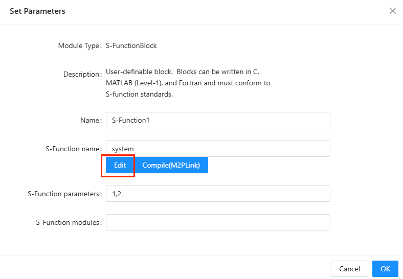
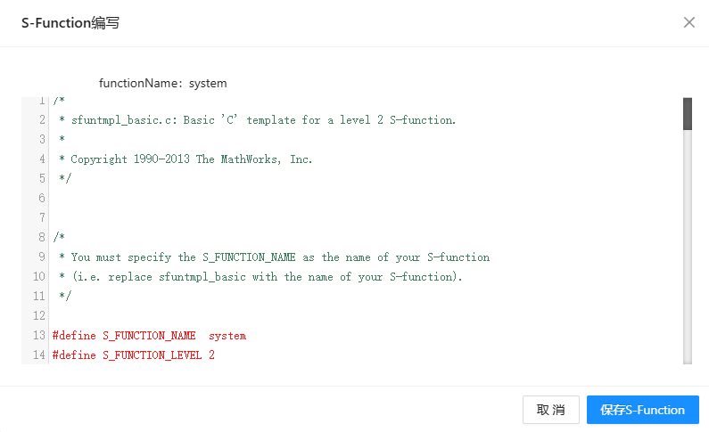
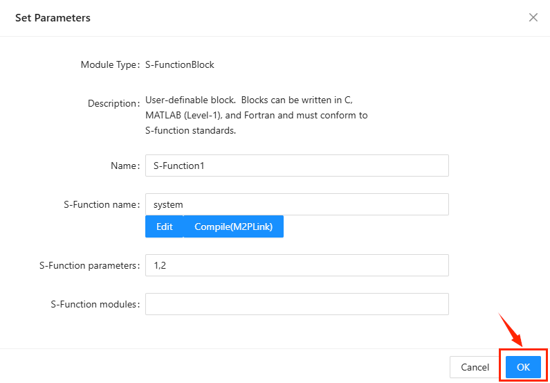
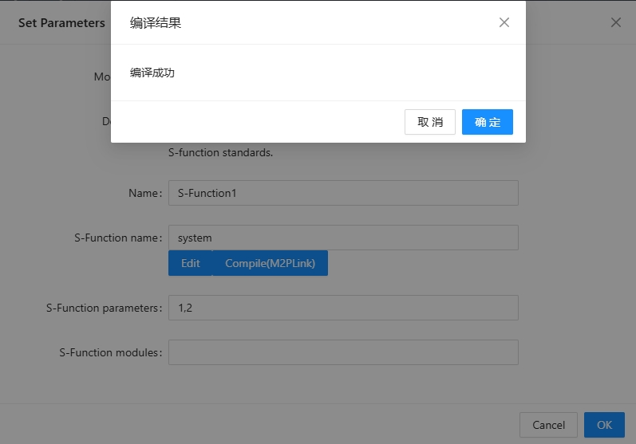

# S-Function模块基本教程

在此介绍S-Function基本操作及已实现的API。

## Steps

在编译之前,系统无法识别S函数的参数,需要编写C版本的S函数模板并编译.

### Edit

拖拽左侧模块库中S-Function栏的S-Function模块.点击Edit按钮,即可打开在线代码编写界面.

为了用户快速上手且与Simulink兼容,使用Simulink中Level 2的C模板.
各部分函数与Simulink相同.如下表所示.

| 函数名       | 功能   |
| :--------  | :-----  | 
| mdlInitializeSizes | 设置参数个数,状态变量个数,输入输出的个数和维度,输入直连,工作向量,采样时间 |
| mdlInitializeSampleTimes | 设置采样时间和偏移量 |
| mdlInitializeConditions | 初始化状态变量 |
| mdlStart | 初始化其他变量 |
| mdlOutputs | 每一步仿真输出 |
| mdlUpdate | 离散状态更新 |
| mdlDerivatives | 连续状态变量微分更新 |
| mdlTerminate | 终端输出(未实现) |

**已经实现的API如下表所示**

| API       | 形参   | 返回值   | 功能   |
| :--------  | :-----  | :-----  | :-----  |
| 输入输出 |   |   |  |
| ssSetNumInputPorts(S, num) | (SimStruct *, int) | void | 设置输入端口个数 |
| ssSetNumOutputPorts(S, num) | (SimStruct *, int) | void | 设置输出端口个数 |
| ssGetNumInputPorts(S) | (SimStruct *, int) | int | 获得输入端口个数 |
| ssGetNumOutputPorts(S) | (SimStruct *, int) | int | 获得输出端口个数 |
| ssSetInputPortWidth(S, idx, width) | (SimStruct *, int, int) | void | 设置输入端口idx的维度width |
| ssSetOutputPortWidth(S, idx, width) | (SimStruct *, int, int) | void | 设置输出端口idx的维度width |
| ssGetInputPortSignal(S, idx) | (SimStruct *, int) | REAL * 或 REAL[] * | 获得输入端口idx的信号值指针 |
| ssGetOutputPortSignal(S, idx) | (SimStruct *, int) | REAL * 或 REAL[] * | 获得输出端口idx的信号值指针 |
| 参数 |   |   |  |
| ssSetNumSFcnParams(S,num) | (SimStruct *, int) | void | 设置参数个数 |
| ssGetNumSFcnParams(S) | (SimStruct *) | int | 获得参数个数 |
| ssGetSFcnParamsCount(S) | (SimStruct *) | int | 获得参数个数 |
| ssGetSFcnParam(S,idx) | (SimStruct *, int, int) | PARAMETER | 获得参数结构体 |
| mxGetPr(parameter)| (PARAMETER) | REAL | 返回传入参数结构体中的参数值 |
| 状态变量 |   |   |  |
| ssSetNumContStates(S,num) | (SimStruct *, int) | void | 设置连续状态变量个数 |
| ssSetNumDiscStates(S,num) | (SimStruct *, int) | void | 设置离散状态变量个数 |
| ssGetContStates(S) | (SimStruct *) | REAL[] * | 返回连续状态变量数组指针 |
| ssGetRealDiscStates(S) | (SimStruct *) | REAL[] * | 返回离散状态变量数组指针 |
| ssGetdX(S) | (SimStruct *) | REAL[] * | 返回连续状态变量导数值的数组指针 |
| 采样时间 |   |   |  |
| ssSetNumSampleTimes(S,num) | (SimStruct *, int) | void | 设置采样时间个数(当前只支持1个) |
| ssSetSampleTime(S,idx,sampleTime) | (SimStruct *, int, REAL) | void | 设置第idx个采样时间 |
| ssSetOffsetTime(S,idx,offsetTime) | (SimStruct *, int, REAL) | void | 设置第idx个偏移时间 |
| 工作向量 |   |   |  |
| ssSetNumRWork(S, num) | (SimStruct *, int) | void | 设置有理数工作向量个数 |
| ssSetNumIWork(S, num) | (SimStruct *, int) | void | 设置整型工作向量个数 |
| ssSetNumPWork(S, num) | (SimStruct *, int) | void | 设置void型工作向量个数 |
| ssGetNumRWork(S) (S->sizes.numRWork) | (SimStruct *) | int | 返回有理数工作向量个数 |
| ssGetNumIWork(S) (S->sizes.numIWork) | (SimStruct *) | REAL[] * | 返回整型工作向量个数 |
| ssGetNumPWork(S) (S->sizes.numPWork) | (SimStruct *) | REAL[] * | 返回void型工作向量个数 |
| ssGetRWork(S) | (SimStruct *) | REAL[] * | 返回有理数工作向量指针 |
| ssGetIWork(S) | (SimStruct *) | REAL[] * | 返回整型工作向量指针 |
| ssGetPWork(S) | (SimStruct *) | REAL[] * | 返回void型工作向量指针 |
| 其他 |   |   |  |
| sfcnGetT() | | REAL | 返回当前仿真时间 |
| sfcnIsMajorStep() | | int | 返回当前仿真步数 |

### Compile

编写并保存代码后
**注意:由于Parameters也需保存,保存完代码仍需保存整个模块,如图所示**

点击Compile按钮,弹窗会显示编译成功或错误信息.

## API

**已知但未实现的API**
| API       | 形参   | 返回值   | 功能   |
| :--------  | :-----  | :-----  | :-----  |
| ssSetInputPortRequiredContiguous(S, idx, value) |   |   |  |
| ssSetInputPortDirectFeedThrough(S, idx, value) |   |   |  |
| ssSetNumNonsampledZCs(S, num) |   |   |  |
| ssSetSimStateCompliance(S,num) |   |   |  |
| ssSetOptions(S,num) |   |   |  |
| ssSetNumModes(S, num) | (SimStruct *, int) | void | 设置有理数工作向量个数 |
| ssGetNumModes(S) (S->sizes.numModes) | (SimStruct *) | REAL[] * | 返回连续状态变量数组指针 |