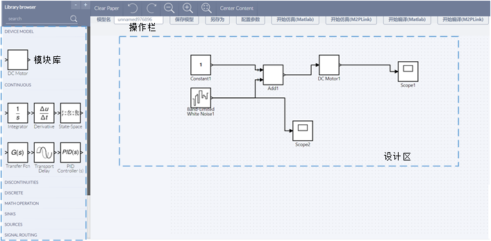
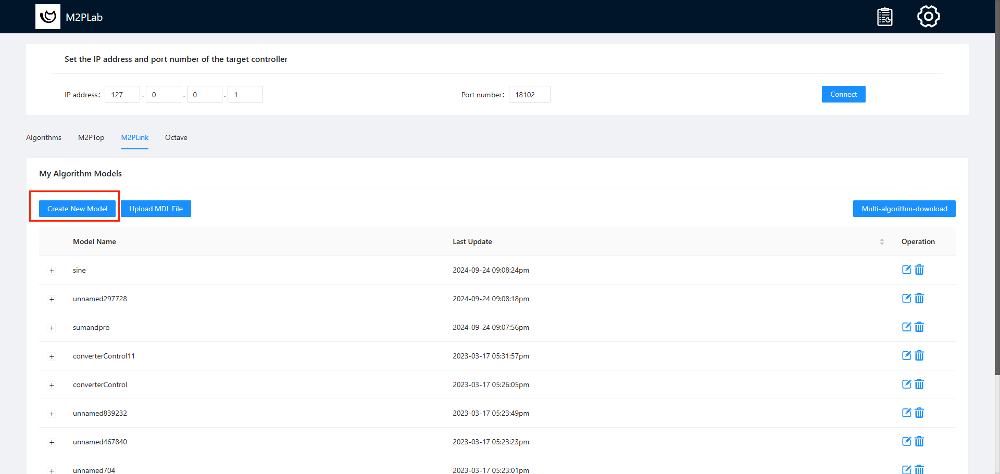
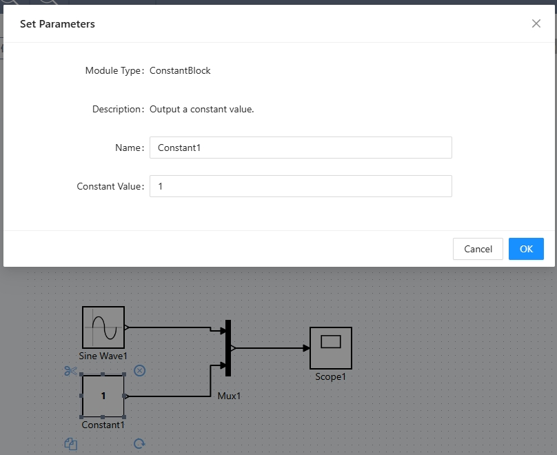

# M2PSim基本教程

在此介绍如何使用M2PSim搭建控制算法模型并进行仿真。

## System Start

### Development Mode

1. Frontend
   在frontend文件夹下运行：

```
yarn start
```

2. Nginx
   在Server文件夹下双击start.bat文件
3. Backend
   eclipse运行ncslablink工程，启动Tomcat 8.5服务器

## M2PSim界面



**模块库**：包含已开发的所以模块，由模块库拖拽模块到设计区完成实例化。

**设计区**：在设计区设计控制算法，包括搭建模块，修改模块配置，完成连线等。

**操作区**：包括以下输入框和按钮：

| 按钮/输入框       | 功能   |
| :--------  | :-----  | 
| 模型名称 | 当前算法模型名称（可修改） |
| 保存模型 | 保存当前模型|
| 另存为 | 另存当前模型|
| 配置参数 | 配置算法仿真参数和编译参数|
| 开始仿真 | 仿真当前算法并返回结果 |
| 开始编译 | 生成Raspberry Pi平台的控制代码 |
| 开始编译(STM32) | 生成STM32平台的控制代码 |

## Steps

### 1.Create new model



### 2.Build Agorithm

操作同Simulink
双击模块修改模块参数，在端口处点击鼠标拖至另一端口完成连线


### 3.Start Simulation

单击操作区开始仿真按钮。

### 4.Result

双击Scope可查看输出曲线。


