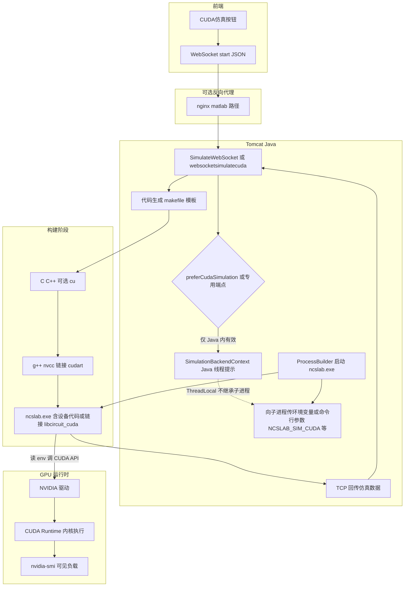

# CUDA 加速大致流程（NCSLab：WebSocket → Java → ncslab / 可选 JNI）

下图描述从「前端意图」到「GPU 真正参与计算」的**完整链路**；灰色虚线为**当前仓库尚未接好**、要做真加速时必须补齐的部分。



## 分层说明

| 阶段 | 做什么 | 是否等于 GPU 加速 |
|------|--------|-------------------|
| ① 前端 | `preferCudaSimulation: true` 或连 `websocketsimulatecuda` | 否，仅表达意图 |
| ② Java | `SimulationBackendContext`、发 `simulation_backend_cuda` 等 | 否，仅 JVM 内提示 |
| ③ 传子进程 | `ProcessBuilder.environment().put("NCSLAB_SIM_CUDA","1")` 等 | 否，只是把开关交给 exe |
| ④ 构建 | makefile 增加 `nvcc`、`libcudart`、或链接 `circuit_cuda` | 准备具备 GPU 能力 |
| ⑤ 运行 | `ncslab` 内读 env 并调用 kernel / 设备库 | **是**，再配合 nvidia-smi 验证 |

## 可选支线：不经 ncslab，在 JVM 内 JNI

若热点在 Java ODE 路径而非子进程，可在同一进程加载 `circuit_cuda`（见仓库 `native/circuit_cuda`），此时不依赖 `ProcessBuilder` 传 env，但仍需 **Toolkit + 链接 CUDA + 在热点处调用**。

---

## 简略说明（面向产品 / 方案，不展开实现细节）

### 什么情况下 CUDA 才「值得」或「能够」帮上忙

大致是：**单步里数值计算量很大、且容易拆成大量并行小任务** 的情形。例如：状态维数或网络规模很大、同一时间步里要对大量支路或样本做同类运算、或同一模型要连续跑很多组参数（蒙特卡洛、扫参）等。反过来，若每步很快、模型很小，或时间主要花在联网、写盘、等定时器上，GPU 往往帮不上忙甚至更慢。

### 仿真的「哪一块」会被加速

加速针对的是**时间推进里最耗 CPU 的那一段数值内核**（例如每步的积分右端、大规模线性代数、成批器件评估等），而不是整条业务链上的每一环。界面、会话、把曲线推回浏览器、生成工程文件等，通常仍和以前一样在 CPU 与现有架构里完成。

### 和原先「纯 C 语言仿真」的差别是什么

原先的典型流程是：生成 C 程序，在 CPU 上顺序或少量多线程完成整段仿真。引入 CUDA 后，**模型与步进逻辑可以不变**，变化在于：把其中**算得最重、又适合并行**的那一段，改到显卡上执行；因此需要合适的 NVIDIA 环境与显存，部署和排错会比「只有 CPU」多一层依赖。对用户可见的交互（例如仍点仿真、仍看波形）可以保持一致，区别主要在**后台算力从以 CPU 为主变为 CPU 组织 + GPU 承担大头数值**。

---

## 文字仿真流程图（与 C 语言仿真的区别）

下面用「自上而下」的文字流程图描述整条仿真链路；**加粗**标出与「纯 C 仿真」不同的环节。

### 一、纯 C 语言仿真（传统路径）

```
用户点击仿真
    │
    ▼
前端建立 WebSocket，发送「开始仿真」及模型数据
    │
    ▼
Java 服务：校验、生成 C/C++ 工程、调用编译器得到 ncslab 可执行文件
    │
    ▼
Java 启动 ncslab 子进程，通过套接字约定交换数据
    │
    ▼
ncslab 在 CPU 上按时间步推进：每步的方程、输出、离散更新等**全部由 CPU（及可选多线程）完成**
    │
    ▼
ncslab 把当前时刻、曲线等结果写回 Java
    │
    ▼
Java 经 WebSocket 推送给前端展示
    │
    ▼
用户看到波形与结束状态
```

**特征一句话：** 数值时间推进的**全部算力**在 **CPU** 上完成；没有显卡参与数值。

---

### 二、带 CUDA 的仿真（目标形态；与上者的差别）

```
用户点击仿真（可选用「希望 GPU 参与」的入口或开关）
    │
    ▼
前端建立 WebSocket，发送「开始仿真」及模型数据，并带上「希望走 GPU 数值路径」的约定
    │
    ▼
Java 服务：校验、生成工程；**编译阶段得到「含 GPU 侧程序或库」的 ncslab**（与纯 C 相比，多一步把部分算法编进可执行文件或动态库）
    │
    ▼
Java 启动 ncslab 子进程，**并告知子进程「本次是否启用 GPU 数值分支」**（与纯 C 相比，多一次「把意图传到子进程」）
    │
    ▼
ncslab 仍由 CPU 负责进程调度、与 Java 通讯、不适合并行的零碎逻辑；**时间推进中最重、已迁移到 CUDA 的那一段，在 GPU 上执行**，结果回到 CPU 侧再参与下一步或写回
    │
    ▼
ncslab 把当前时刻、曲线等结果写回 Java（对前端的协议可与纯 C 一致）
    │
    ▼
Java 经 WebSocket 推送给前端展示
    │
    ▼
用户看到波形与结束状态
```

**与纯 C 的三点区别（对照看即可）：**

1. **编译产物**：纯 C 只有「CPU 指令」；带 CUDA 时，产物里**多出**能在显卡上跑的那部分（与驱动、工具链绑定）。  
2. **运行时的算力分工**：纯 C 时**整段数值**在 CPU；带 CUDA 时，**约定好的重载数值块**在 GPU，其余仍在 CPU。  
3. **环境与运维**：纯 C 主要依赖本机 CPU 与编译链；带 CUDA 时**还必须**具备可用的 NVIDIA 显卡与驱动，排障时要同时看 CPU 进程与 GPU 是否真有负载。

---

### 三、并排对照（便于汇报）

| 环节 | 纯 C 语言仿真 | 带 CUDA 的仿真 |
|------|----------------|----------------|
| 用户操作与前端 | 点仿真、发模型 | 相同；可多个「是否用 GPU」的入口 |
| Java 与网络 | 生成、编译、起进程、收结果 | 相同；**多传「用 GPU」的意图给子进程** |
| 时间步里的**主要数值** | 全在 **CPU** | **约定块在 GPU**，其余在 CPU |
| 编译与部署 | 编译器 + 运行库为主 | 另依赖 **CUDA 与显卡** |
| 用户看到的曲线 | 由数值结果决定 | 若迁移正确，**应与纯 C 一致或接近**（取决于算法与精度策略） |
